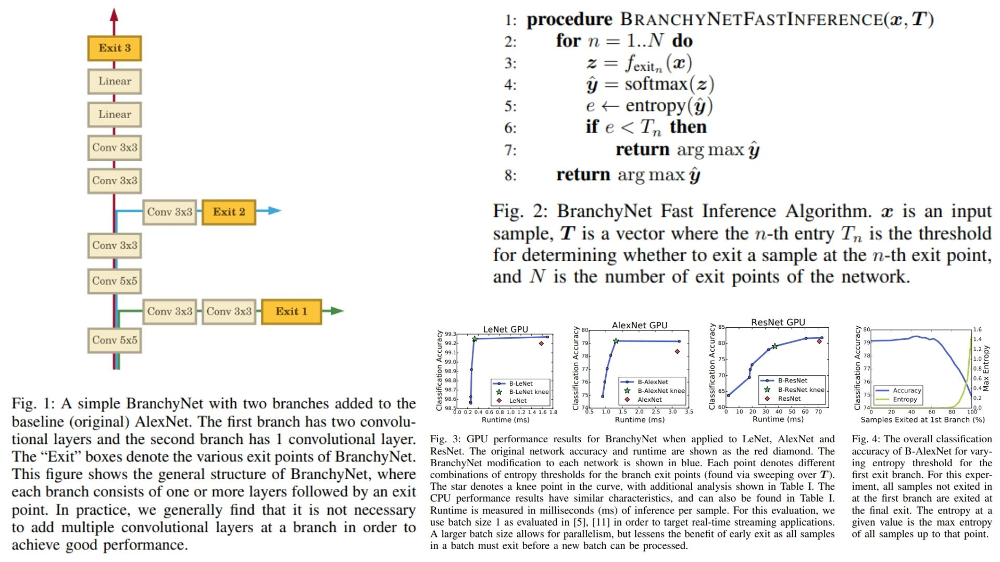

# 🌿 BranchyNet Replication – Fast Inference DNN

This repository provides a **PyTorch-based replication** of the  
**BranchyNet: Fast Inference via Early Exiting from Deep Neural Networks**.

The focus is **understanding how early-exit branches reduce inference time**  
rather than achieving state-of-the-art accuracy.

- Backbone DNN with **side branches** 🐝  
- Early exits allow confident samples to leave network 🍬  
- Entropy-based **exit decision** 🎃  
- Joint optimization improves **accuracy & gradient flow** 🌱  

**Paper reference:** [BranchyNet – Teerapittayanon et al., 2017](https://arxiv.org/abs/1709.01686) 🌴

---

## 🌌 Overview – BranchyNet Architecture



## 🚀 High-level Pipeline

1. **Input image**

```math
x \in \mathbb{R}^{C \times H \times W}, \quad \text{feat} = f_{\text{backbone}}(x)
```

2. **Branch outputs**

```math
z_n = f_{\text{branch}_n}(\text{feat}), \quad
\hat{y}_n = \text{softmax}(W_n z_n + b_n)
```

3. **Entropy at each exit**

```math
H(\hat{y}_n) = - \sum_{c \in \mathcal{C}} \hat{y}_{n,c} \log(\hat{y}_{n,c})
```

4. **Early exit decision**

```math
\text{if } H(\hat{y}_n) < T_n, \text{ exit with } \hat{y}_n
```

5. **Final classifier**

```math
z_f = \text{feat} \quad (\text{or last branch output}), \quad
\hat{y}_{\text{final}} = \text{softmax}(W_f z_f + b_f)
```


---

## 🧠 What the Model Learns

- **Backbone**: hierarchical feature extraction  
- **Branches**: allow confident samples to exit early → faster inference  
- **Joint loss**:
```math
\mathcal{L}_{\text{BranchyNet}} = \sum_{n=1}^{N} w_n \cdot \mathcal{L}_n(\hat{y}_n, y)
```

   regularizes both main and side branches  
- **Entropy threshold**: balances speed vs. accuracy

---

## 📦 Repository Structure

```bash
BranchyNet-Replication/
├── src/
│   ├── layers/
│   │   ├── conv_block.py            # Reusable Conv + activation block for feature extraction
│   │   ├── activation.py            # Activation functions (ReLU, LeakyReLU, Sigmoid, etc.)
│   │   ├── normalization.py         # Normalization layers (BatchNorm, LayerNorm)
│   │   └── pooling.py               # Pooling operations (MaxPool, AvgPool)
│   │
│   ├── exits/
│   │   ├── entropy.py               # Entropy computation for early-exit confidence
│   │   └── exit_decision.py         # Threshold-based early-exit decision logic
│   │
│   ├── blocks/
│   │   ├── backbone_block.py        # Backbone network blocks (VGG/ResNet-style)
│   │   ├── branch_block.py          # Side branch attached to the backbone
│   │   └── classifier_head.py       # Lightweight classifier for each exit
│   │
│   ├── model/
│   │   └── branchynet.py            # Full model: backbone with multiple early exits with Forward pass with early-exit control flow
│   │
│   ├── loss/
│   │   └── joint_loss.py            # Weighted sum of losses from all exits (theoretical)
│   │
│   └── config.py                    # Number of exits, entropy thresholds, loss weights
│
├── diagrams/
│   └── figmix.jpg                 
│
├── requirements.txt                
└── README.md                     

```
---


## 🔗 Feedback

For questions or feedback, contact: [barkin.adiguzel@gmail.com](mailto:barkin.adiguzel@gmail.com)
